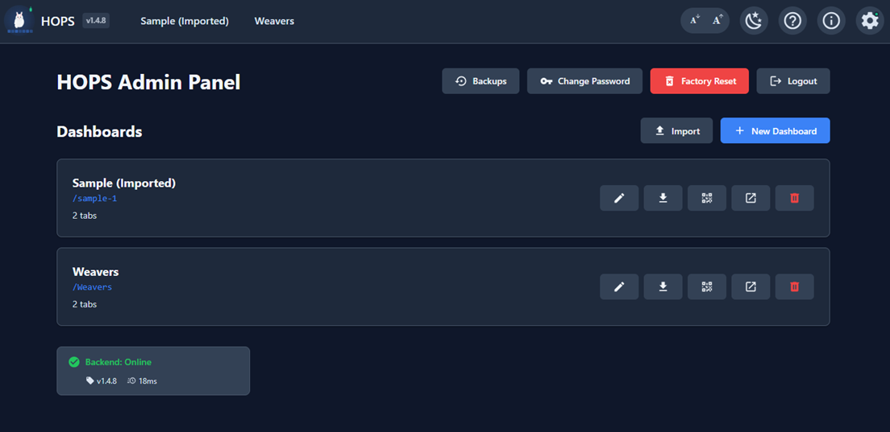
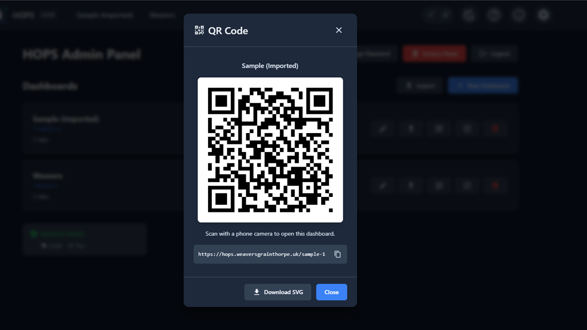
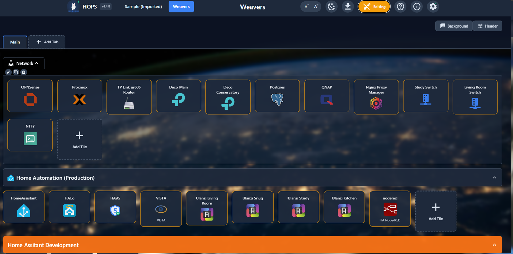
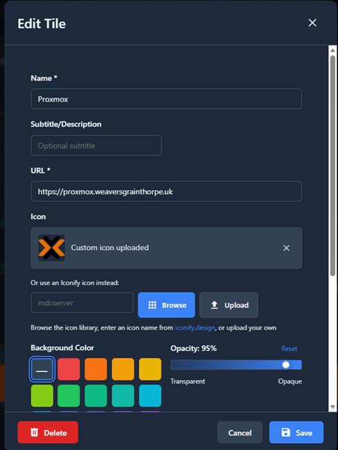
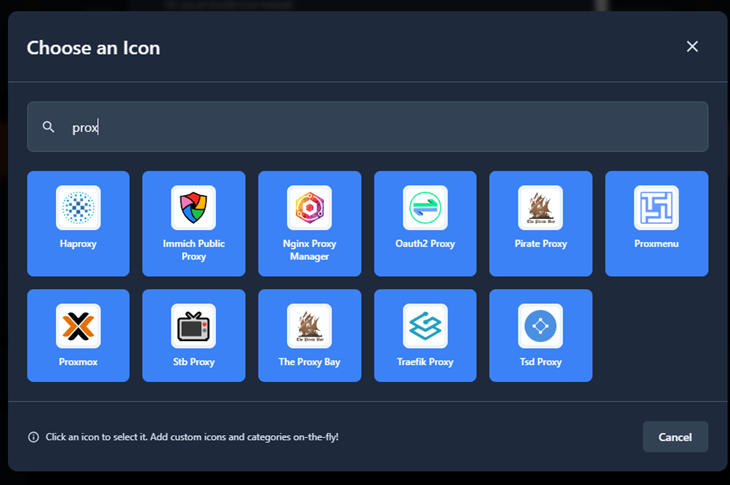
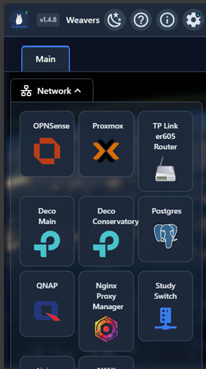
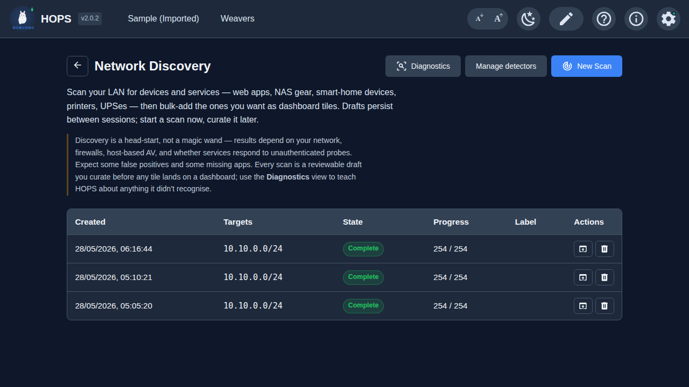
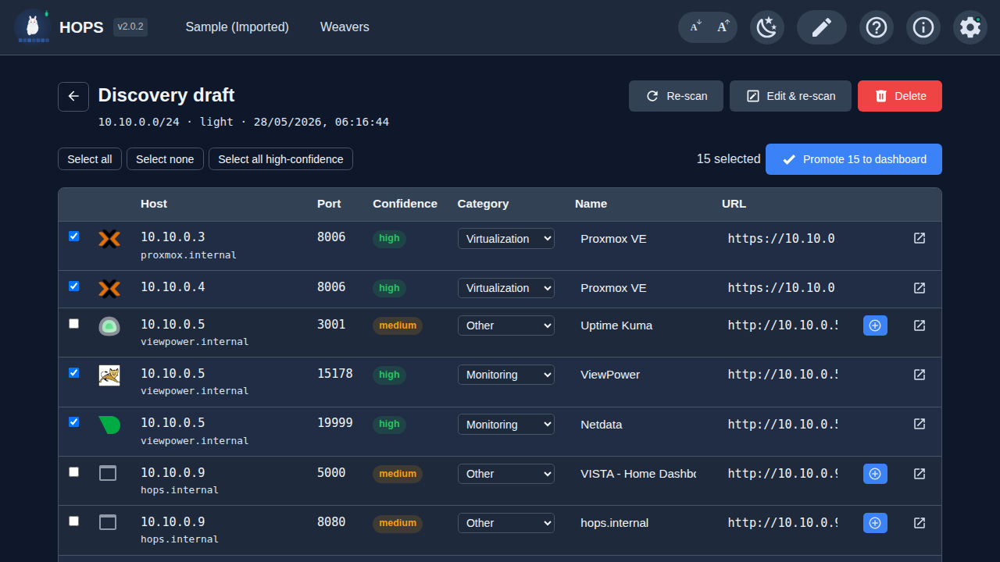
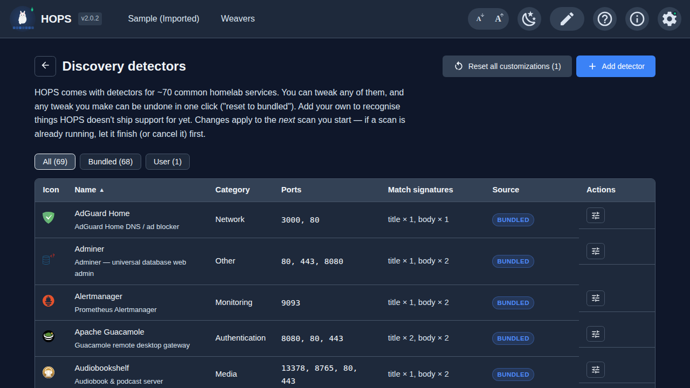

# HOPS - Home Operations Portal System

**Version 2.2.0** · **[hops.weaversgrainthorpe.github.io →](https://weaversgrainthorpe.github.io/HOPS/)**

A modern, self-hosted homepage dashboard for the homelab community.


## Why Another Dashboard?

Yes, there are already plenty of homelab dashboard and bookmark applications out there: Homer, Dashy, Heimdall, Homepage, Organizr, Homarr, and more. If you're using one and happy with it, stick with it. Seriously.

I created HOPS because none of the existing options matched what I wanted:

- **100% GUI-based editing** - I wanted to click, drag, and configure everything visually. No YAML files. No JSON editing. No "simple" configuration files that inevitably become not-so-simple. If you enjoy hand-crafting configuration files, HOPS isn't for you. Close this tab. Now.

- **Native installation** - HOPS is a single binary with a SQLite database. Download, run, done. Docker is available too if that's your thing.

- **Power features without complexity** - Drag-and-drop everything. Multiple dashboards. Tabs. Groups. Background slideshows. Theme customization. Status monitoring. Network discovery that scans your LAN and bulk-adds tiles for the services you already run. All configurable through the UI.

HOPS won't be for everyone. That's fine. But if you've been frustrated editing YAML indentation at 11pm, or wished you could just *click* to add a new bookmark, maybe give it a try.

Already using Homer, Dashy, or Heimdall? HOPS can import your existing configuration, so you can try it without starting from scratch.

## Screenshots

<table>
  <tr>
    <td width="33%" valign="top">
      <a href="docs/screenshots/admin.png"></a>
      <p align="center"><sub><b>Admin page</b> — manage multiple dashboards from one place</sub></p>
    </td>
    <td width="33%" valign="top">
      <a href="docs/screenshots/admin1.png"></a>
      <p align="center"><sub><b>QR codes</b> — share any dashboard with a phone, no typing</sub></p>
    </td>
    <td width="33%" valign="top">
      <a href="docs/screenshots/edit-mode.png"></a>
      <p align="center"><sub><b>Edit mode</b> — drag-and-drop tiles, groups, and tabs; no YAML</sub></p>
    </td>
  </tr>
  <tr>
    <td width="33%" valign="top">
      <a href="docs/screenshots/edit-tile.png"></a>
      <p align="center"><sub><b>Tile editor</b> — every option in one modal; nothing hidden in config files</sub></p>
    </td>
    <td width="33%" valign="top">
      <a href="docs/screenshots/icon-picker.png"></a>
      <p align="center"><sub><b>Icon picker</b> — search thousands of bundled icons, or upload your own</sub></p>
    </td>
    <td width="33%" valign="top">
      <a href="docs/screenshots/mobile.png"></a>
      <p align="center"><sub><b>Mobile</b> — responsive layout works on phones and tablets</sub></p>
    </td>
  </tr>
  <tr>
    <td width="33%" valign="top">
      <a href="docs/screenshots/admin-discovery.png"></a>
      <p align="center"><sub><b>Network Discovery</b> — scan your network for services already running</sub></p>
    </td>
    <td width="33%" valign="top">
      <a href="docs/screenshots/admin-discovery-draft.png"></a>
      <p align="center"><sub><b>Curate before promoting</b> — review what was found, tick the ones you want</sub></p>
    </td>
    <td width="33%" valign="top">
      <a href="docs/screenshots/admin-discovery-detectors.png"></a>
      <p align="center"><sub><b>Detectors</b> — ~70 services recognised out of the box, tweak any of them</sub></p>
    </td>
  </tr>
</table>

## Quick Start

HOPS runs on **Linux**, **macOS**, and **Windows** with no dependencies. It works on anything from a Raspberry Pi to a full server.

**Binary** — download one file, run it (the web UI is built in):
```bash
chmod +x hops-linux-amd64
./hops-linux-amd64 --data ./data
```

**Docker** — if you'd rather, or already run a Compose stack:
```bash
docker compose up -d
```

Default login: `admin` / `admin` — change this immediately after first login.

**New to HOPS?** Follow the **[Zero to Dashboard Hero](QUICKSTART.md)** guide for a complete walkthrough from installation to your first dashboard.

For full deployment options (systemd, reverse proxy, backups), see the **[Installation & Deployment Guide](DEPLOY.md)**.

## Features

### Core
- **GUI-First**: Full visual editor — no YAML, no config files, no CLI required
- **Single Binary**: One executable + SQLite database, no runtime dependencies
- **Multi-Platform**: Linux, macOS, Windows — x86-64 and ARM64
- **Docker Support**: Dockerfile and docker-compose.yml included
- **No Login for Viewers**: Just share a URL, it works
- **Admin Mode**: Separate login for editing
- **Built-in Help**: Context-sensitive help system in edit mode

### Navigation
- Multiple dashboards (e.g., /home, /network, /media)
- Tabs within each dashboard
- Collapsible groups within tabs
- Per-group row width (full / half / third) — multi-column group layouts
- Drag-and-drop for tabs, groups, and tiles
- Cross-group drag & drop for tiles
- Copy/cut/paste for tiles between groups and tabs
- Global search — press `/` to jump to any tile by name, URL, or description
- Arrow-key navigation between tiles (browse mode)
- Right-click context menu

### Visual Customization
- Per-dashboard and per-tab backgrounds
- Background slideshow with 18 transition effects (crossfade, slide, zoom, Ken Burns, and more)
- Configurable background overlay opacity and blur
- Upload custom background images or choose from ~90 curated presets
- Theme hierarchy: Dashboard → Tab → Group → Tile (colour and opacity cascade)
- ~2,300 bundled app/service icons (homarr-labs/dashboard-icons), plus access to 200,000+ Iconify icons by name (the ones the UI uses are embedded for offline use; an uncommon name you type is fetched on demand), plus custom icon uploads
- "My Uploads" and "Recently Used" icon categories
- Multiple tile sizes (small, medium, large)
- 8 theme presets with light/dark/auto modes
- Custom colours and opacity at every level

### Entries/Tiles
- Two tile types: **link** (default — opens a URL) and **note** (text-only, name + description, no click action)
- Open modes: iframe, new tab, same tab, popup modal
- HTTP status monitoring with response time
- Subtitles/descriptions on tiles
- Custom tile colours and opacity
- Cross-group drag & drop
- Right-click context menu

### Network Discovery (v2.0)
- **Scan your network** — give it an IP range (`10.10.0.0/24`, `10.10.0.1-50`, individual addresses, or any mix). Skip the things you don't want scanned with a `!` prefix
- **Recognises ~70 common homelab services out of the box** — Pi-hole, Plex, Proxmox, Home Assistant, every *arr, NPM, UniFi, OPNsense/pfSense, Frigate, TrueNAS/QNAP/Synology, Vaultwarden, Immich, Audiobookshelf, Grafana, Traefik, MinIO, pgAdmin/phpMyAdmin/Adminer, Guacamole, Netdata, and many more
- **Three intensities** — *Passive* listens for services that announce themselves (mDNS, UPnP, etc.) without touching any ports. *Light* (default) adds a quick check of ~40 well-known homelab ports. *Full* sweeps ~60. Start with Light
- **Finds things without scanning too** — picks up mDNS announcements (smart TVs, AirPlay, Sonos), router neighbour tables, your network's DNS, and SNMP from printers/switches/UPSes
- **Knows about subdomains** — give it your internal domain (the one your reverse proxy serves under) and it'll try common names like `sonarr.yourdomain` so services hidden behind a reverse proxy aren't missed
- **Review before adding** — every scan produces a draft you tick through. Confidence indicators on each row, edit the name / URL / icon inline, bulk-select, and tiles automatically slot into sensible groups when you accept (Sonarr → *Downloads*, Pi-hole → *Network*)
- **Add or tweak the recognisers yourself** — through the admin UI, no config files. Customise any built-in recogniser; if you change your mind, one click puts it back
- **Find what didn't match** — a Diagnostics view shows every service HOPS spotted but couldn't put a name to. One click bootstraps a new detector with everything HOPS already knows about it

> **A reality check.** Discovery is a head start, not magic. What it
> finds depends on your network (Wi-Fi vs wired, guest networks that
> isolate devices), what's blocking it (firewalls, antivirus software,
> services that only answer on localhost), and whether each service
> answers polite "are you there?" questions to begin with. So expect a
> few false matches and a few things it just doesn't catch. That's why
> every scan is a **draft** — you tick through what's actually wanted
> before anything lands on your dashboard — and why the Diagnostics
> view turns *"HOPS missed this"* into a working detector in two
> clicks. Coverage keeps improving with each release.

### Admin Panel
- Create, rename, and delete dashboards
- **QR codes** — generate scannable codes for any dashboard URL (open the dashboard on a phone/tablet without typing)
- Self-contained export/import with embedded assets
- Single-dashboard export
- Import from Homer, Dashy, and Heimdall
- Automatic database backups on startup (async — doesn't block boot)
- Backup management (restore and delete) with auto-restart after restore
- Forced password change on first login (no more accidentally leaving the default `admin/admin` in production)

### Mobile
- Dashboards are mobile-friendly with responsive layouts (480px / 768px / 1024px breakpoints)
- Editing is **disabled on phones** (touchscreen drag-and-drop is awkward) — manage your dashboards from desktop/tablet, view them anywhere

### Security
- Bcrypt password hashing with forced first-login password change
- HttpOnly session cookies + CSRF protection (double-submit cookie pattern)
- Per-IP rate limiting on login (20/min/IP)
- Path-traversal hardening on backup/restore operations
- SQLite foreign-key enforcement and cascading deletes
- All admin endpoints behind authentication + CSRF middleware

## Tech Stack

- **Frontend**: SvelteKit 2 + Svelte 5 + TypeScript
- **Backend**: Go (single binary, pure Go, no CGO)
- **Database**: SQLite (pure Go implementation via modernc.org/sqlite)
- **Icons**: ~2,300 bundled SVGs (homarr-labs/dashboard-icons) + Iconify (200,000+ by name; the icons the UI uses are embedded for offline rendering, uncommon names fetched on demand)
- **Drag & Drop**: svelte-dnd-action

## Keyboard Shortcuts

| Shortcut       | Action                                      | Mode       |
|----------------|---------------------------------------------|------------|
| `/`            | Open global search                          | Anywhere   |
| `↑ ↓ ← →`      | Move focus between tiles                    | Browse     |
| `Enter`        | Activate focused tile                       | Browse     |
| `Escape`       | Close modal / cancel edit / close search    | Anywhere   |
| `Ctrl+C`       | Copy selected tile                          | Edit       |
| `Ctrl+X`       | Cut selected tile                           | Edit       |
| `Ctrl+V`       | Paste tile into focused group               | Edit       |
| `Ctrl+Enter`   | Save and close modal                        | Edit       |

## Roadmap

Future improvements are tracked in **[ROADMAP.md](ROADMAP.md)** — a tiered
wishlist (quick wins → architectural shifts) with effort/risk notes. Nothing
on the list is committed work; HOPS is maintained in spare time and the
CHANGELOG records what actually ships.

## Documentation

- **[Zero to Dashboard Hero](QUICKSTART.md)** — Get up and running in 5 minutes
- **[User Guide](USER_GUIDE.md)** — Full feature reference
- **[Installation & Deployment Guide](DEPLOY.md)** — Reverse proxy, systemd, backups
- **[Roadmap](ROADMAP.md)** — Future improvements under consideration

## Tips

- Click the **?** icon in the navbar (when logged in) for help
- Triple-click the HOPS logo when editing for a surprise
- The classics never go out of style: try the Konami code

## Contributing

Contributions are welcome! Please see [CONTRIBUTING.md](CONTRIBUTING.md) for development setup and guidelines.

**Found a bug or have an idea?** Please report issues, bugs, or suggestions for improvements via [GitHub Issues](https://github.com/weaversgrainthorpe/HOPS/issues). I maintain this project in my limited spare time, so while I'll do my best to review and consider all feedback, I can't guarantee when (or if) I'll be able to address them. Your patience is appreciated!

**Security issues?** Please see [SECURITY.md](SECURITY.md) for responsible disclosure instructions. Do not open public issues for vulnerabilities.

## License

MIT
